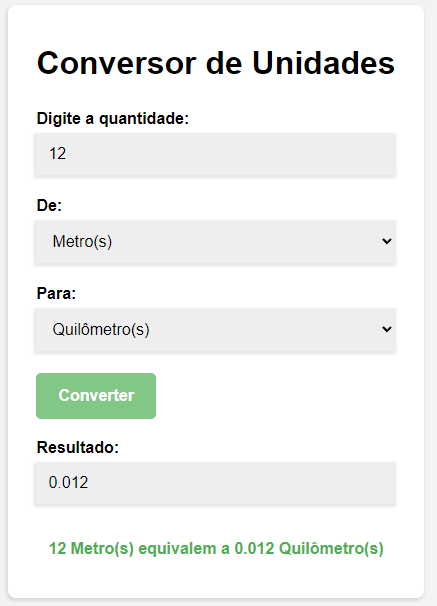

  

## Conversor de Unidades - 🖥️
Projeto feito para fins de estudos de HTML, CSS e principalmente JavaScript, consiste em colocar a medida(valor) que deseja e selecionar para qual medida deseja converter(m, km, cm, mm).

## Tecnologias 🚀
- HTML
- CSS
- JavaScript
- Git e Github